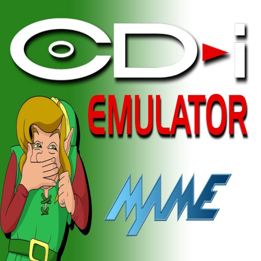

# Philips - CDi (SAME CDi)

### Description

SAME_CDI is a libretro core to play CD-i games. This is a fork and modification of the MAME libretro core.

### License

GPLv2+

### Icon

### Fanart

Help make me fanart!

### Screenshots

Help make me screenshots!
